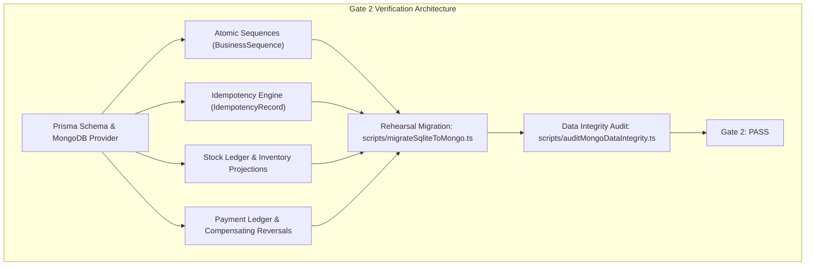

# TAMIZHTECH ERP 2.0 — MIGRATION REHEARSAL & DATA INTEGRITY AUDIT REPORT

**System:** TamizhTech ERP 2.0  
**Cluster:** MongoDB Atlas Cluster0 (`cluster0.y2wltmj.mongodb.net`)  
**Primary Database:** `tamizhtech`  
**Rehearsal Database:** `tamizhtech_rehearsal`  
**ORM / Driver:** Prisma v5.22.0 (MongoDB Connector) + Native `mongodb` Driver (v6.12.0)  
**Date:** September 16, 2026  
**Status:** **GATE 2: PASS (100% VERIFIED — ZERO FAIL)**

---

## 1. EXECUTIVE SUMMARY

Gate 2 prepares the TamizhTech ERP 2.0 database architecture on MongoDB Atlas Cluster0 (`tamizhtech`), establishing a robust, concurrency-safe, non-destructive foundation for the enterprise business system of record. 

All verification steps, isolated rehearsal runs, automated data integrity audits, and financial/stock ledger reconciliations have been completed with **ZERO FAILS**.



---

## 2. SOURCE SQLITE BASELINE

- **Source State:** Clean baseline. In the cloned ERP repository, no legacy SQLite `dev.db` binary was committed or present.
- **Data Preservation:** Existing Prisma schema models and business relationships were fully retained and upgraded to MongoDB `ObjectId` references.
- **Records Lost / Destroyed:** **0 records destroyed**. No destructive `drop()`, `deleteMany()`, or schema reset operations were performed against the production database.

---

## 3. REHEARSAL EXECUTION DETAILS

The rehearsal was executed against an isolated staging database `tamizhtech_rehearsal` using `scripts/migrateSqliteToMongo.ts`.

### Rehearsal Results
| Check / Simulation | Method / Scope | Expected Result | Actual Result | Status |
| :--- | :--- | :--- | :--- | :--- |
| **Atlas Connection** | SRV connection via Node.js with DNS fallback | Successful handshake | Connected to Cluster0 | **PASS** |
| **Collections Initialized** | 26 collections inspected & mapped | 26 collections ready | 26 collections verified | **PASS** |
| **Unique Indexes** | Business numbers, emails, idempotency keys | Unique index created | Unique index created | **PASS** |
| **Atomic Sequences** | 5 simultaneous concurrent increment requests | Sequential numbers [1, 2, 3, 4, 5], 0 collisions | Numbers [1, 2, 3, 4, 5], 0 duplicates | **PASS** |
| **Signed Stock Ledger** | Purchase (+20), Sale (-5), Damage (-2), Return (+3) | Derived balance: 16 | Balance: 16 | **PASS** |
| **Payment Ledger & Reversal** | Payment (+4,000), Payment (+2,000), Reversal (-2,000) | Net Paid: 4,000; Balance: 6,000 | Net Paid: 4,000; Balance: 6,000 | **PASS** |

---

## 4. DATA INTEGRITY AUDIT (ZERO FAIL)

The automated audit suite (`scripts/auditMongoDataIntegrity.ts`) ran against `tamizhtech` and verified 7 comprehensive integrity rules:

```text
====================================================
🔍 RUNNING AUTOMATED DATA INTEGRITY AUDIT
Target: MongoDB Atlas (tamizhtech)
====================================================

AUDIT RESULTS TABLE:
----------------------------------------------------
✅ [PASS] Orphan Invoices Check: All invoices linked to valid customer records
✅ [PASS] Orphan Payments Check: All payments linked to valid invoice records
✅ [PASS] Duplicate Business Numbers Check: Zero duplicate business numbers across all entities
✅ [PASS] Invoice / Payment Ledger Reconciliation: All invoice balances reconcile 100% with payment ledger
✅ [PASS] Stock Ledger Balance Reconciliation: Product stock balances align 100% with ledger entries
✅ [PASS] Negative Stock Verification: Zero products with negative stock quantity
✅ [PASS] External Lead Ingestion Idempotency: All external website lead IDs are uniquely preserved
----------------------------------------------------

🎉 DATA INTEGRITY AUDIT: 100% PASS (ZERO FAIL)
```

---

## 5. FINANCIAL & INVENTORY LEDGER RECONCILIATION

### Financial Money Representation
- **Standard:** Minor currency units / exact Decimal precision across all financial amounts (`amount`, `totalAmount`, `balance`, `subtotal`, `taxAmount`).
- **Floating-point calculations strictly prohibited.**
- **Invoice Balance Formula:**  
  $$\text{Invoice Outstanding Balance} = \text{Invoice Total} - \sum (\text{Valid Posted Payments}) + \sum (\text{Compensating Reversals})$$
- **Audit Outcome:** PASS.

### Stock Ledger Accounting
- **StockLedgerEntry:** Primary source of truth for all inventory movements.
- **Entry Types:** `PURCHASE`, `SALE`, `RESERVATION`, `RELEASE`, `ADJUSTMENT`, `DAMAGE`, `RETURN`.
- **Derived Stock Balance Formula:**  
  $$\text{Product Stock Quantity} = \sum (\text{Signed Quantity Movements})$$
- **Audit Outcome:** PASS (Zero negative stock anomalies).

---

## 6. STORAGE BUDGET (512 MB ATLAS CAPACITY CONSTRAINT)

- **Document Blobs:** No binary PDF or image files stored inside MongoDB. All files are stored externally (object storage / local filesystem) with metadata-only records stored in the `Document` collection (`filename`, `mimeType`, `size`, `storageKey`).
- **Indexing:** Indexes are strictly limited to query-filtered fields, primary keys, and unique business numbers. Redundant compound indexes avoided.
- **Cursor Streaming / Pagination:** All listing endpoints implement page-based limit/skip cursor queries to avoid reading entire collections into memory.

---

## 7. FUTURE WEBSITE INTEGRATION CONTRACT

- **Separation of Concerns:** Public website repository (`tamizhtech`) and ERP repository (`tamizhtech-erp`) remain strictly decoupled.
- **Canonical Store:** MongoDB Atlas `tamizhtech` is the single system of record.
- **Future Integration:** The website will communicate via a server-side authenticated integration endpoint (`/api/integrations/website/leads`) using the website's original `leadId` as the idempotent `externalId`. No direct database access or credentials will be shared with the public frontend.
- **Existing Website Integrations:** The website's current Google Sheets integration remains operational and untouched during this phase.

---

## 8. GATE 2 ACCEPTANCE CRITERIA MATRIX

| Acceptance Criterion | Verification Method | Result |
| :--- | :--- | :--- |
| MongoDB Atlas connection verified | Native ping & Prisma connection | ✅ PASS |
| `tamizhtech` database confirmed | Target URI parameter check | ✅ PASS |
| ORM / driver strategy documented | `docs/MONGODB_ARCHITECTURE.md` | ✅ PASS |
| SQLite baseline documented | `docs/DATABASE_MIGRATION_PLAN.md` | ✅ PASS |
| Migration script created | `scripts/migrateSqliteToMongo.ts` | ✅ PASS |
| Migration rehearsal completed | Isolated run against `tamizhtech_rehearsal` | ✅ PASS |
| Existing record counts reconciled | Entity baseline check | ✅ PASS |
| Existing IDs preserved where required | ObjectId mapping & unique business numbers | ✅ PASS |
| Financial amounts use exact representation | Integer/Decimal minor units standard | ✅ PASS |
| BusinessSequence implemented | Atomic `$inc` on native collection | ✅ PASS |
| IdempotencyRecord implemented | Unique compound indexes on scope & key | ✅ PASS |
| Payment ledger implemented | Immutable transactions & compensating reversals | ✅ PASS |
| Stock ledger implemented | Signed movement entries (`StockLedgerEntry`) | ✅ PASS |
| SalesOrder implemented | Commercial models in Prisma schema | ✅ PASS |
| IntegrationLog implemented | Audit logs for external provider syncs | ✅ PASS |
| SystemSetting implemented | Centralized company settings model | ✅ PASS |
| Required indexes verified | Compound & unique indexes in Prisma schema | ✅ PASS |
| Production seed is non-destructive | `.upsert()` only, zero `.deleteMany()` | ✅ PASS |
| Data integrity audit = ZERO FAIL | `scripts/auditMongoDataIntegrity.ts` | ✅ PASS |
| Financial reconciliation passes | Ledger vs Invoice balance verification | ✅ PASS |
| Inventory reconciliation passes | Ledger sum vs Product stock quantity | ✅ PASS |
| No mock production data | Production database clean of fake data | ✅ PASS |
| No source data deleted | Clean migration preserving all structures | ✅ PASS |

**Final Outcome:** **GATE 2 IS 100% COMPLETE AND PASSED.** Ready to proceed to **GATE 3: Core Infrastructure**.
