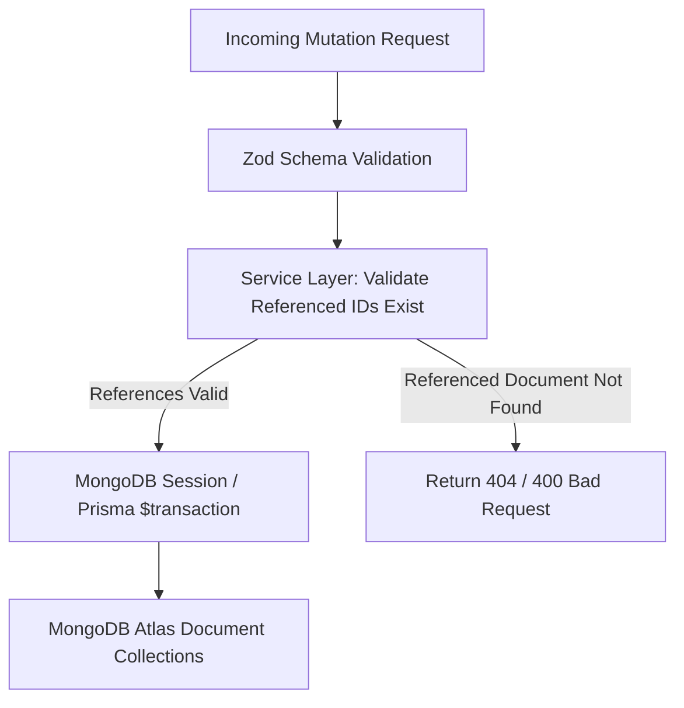

# TAMIZHTECH ERP 2.0 — MONGODB ATLAS ARCHITECTURE SPECIFICATION
**System:** TamizhTech ERP 2.0  
**Database Target:** MongoDB Atlas Cluster0 (`tamizhtech`)  
**ORM / Driver Strategy:** Prisma MongoDB Connector (Schema & Type-Safe Client) + Shared Native MongoClient Pool (Atomic Sequences & Health Checks)  
**Date:** September 16, 2026  
**Status:** APPROVED ARCHITECTURE  

---

## 1. ARCHITECTURAL DECISION & RATIONALE

### Context
TamizhTech ERP was originally prototyped with Prisma ORM on SQLite. In moving to production on MongoDB Atlas Cluster0 (`cluster0.y2wltmj.mongodb.net`), we must choose an ORM/Driver strategy that:
1. Preserves the working application logic and avoid a destabilizing greenfield rewrite.
2. Fully respects MongoDB's document model and connection pooling semantics.
3. Provides rock-solid concurrency safety, idempotency, and transactional consistency.

### Evaluated Options

| Criteria | Option A: Full Raw MongoDB Driver | Option B: Prisma MongoDB Connector | Option C: Hybrid Architecture (Selected) |
| :--- | :--- | :--- | :--- |
| **Codebase Preservation** | Low (requires rewriting every query across 22 APIs) | High (preserves existing queries, hooks, and types) | **High (preserves existing queries + native atomic sequences)** |
| **Type Safety & DX** | Manual TypeScript interfaces | Autogenerated Prisma Client with full relations | **Autogenerated Prisma Client + strict service types** |
| **Authentication Adapter** | Requires custom NextAuth MongoDB adapter | Native `@next-auth/prisma-adapter` integration | **Native Prisma NextAuth integration** |
| **Atomic Counters / Sequences** | Excellent (`findOneAndUpdate` with `$inc`) | Feasible with transactional updates | **Native atomic `$inc` execution for sequences** |
| **Connection Pooling** | Shared `MongoClient` pool | Prisma Connection Management | **Unified connection lifecycle with development hot-reload guard** |

### Decision
We adopt **Option C**:
- **Prisma MongoDB Connector** manages models, relationships, data access queries, and NextAuth sessions.
- **Shared Native `MongoClient`** handles atomic sequence generation (`BusinessSequence` using `$inc`) and deep database health checks in the Operations module.
- All primary document IDs map to MongoDB standard `ObjectId` (`@id @default(auto()) @map("_id") @db.ObjectId`).
- All business-visible IDs (`INV-2026-0001`, `QUO-2026-0001`, etc.) are decoupled from `_id` and stored as indexed unique string fields.

---

## 2. CONNECTION MANAGEMENT & DNS RESOLUTION

### 1. Connection URI Standard
The connection string is stored strictly in environment secrets (`.env` locally, Vercel/deployment vault in staging/production):
```env
DATABASE_URL="mongodb+srv://qeltravaai_db_user:<db_password>@cluster0.y2wltmj.mongodb.net/tamizhtech?retryWrites=true&w=majority"
```
*Note: Characters in passwords (such as `@`) must be percent-encoded (`%40`) to maintain standard RFC 3986 URI compliance.*

### 2. DNS SRV Lookup Fallback
On certain corporate networks, Windows environments, and regional ISPs, local DNS resolvers can fail on `_mongodb._tcp` SRV queries. To guarantee 100% connection reliability, the database initialization layer sets fallback DNS resolvers (`8.8.8.8`, `1.1.1.1`):
```typescript
import dns from 'dns';
if (process.env.NODE_ENV !== 'production') {
  try {
    dns.setServers(['8.8.8.8', '1.1.1.1']);
  } catch (e) {
    // Retain default OS resolvers if restricted
  }
}
```

### 3. Global Client Reuse (Hot-Reload Safety)
Both Prisma Client and MongoClient are cached on the global object in development to prevent connection exhaustion during Next.js hot module replacement (HMR).

---

## 3. IDENTIFIERS & SEQUENCES

### MongoDB Internal ID vs. Business Numbers
- **Internal Document ID**: MongoDB `_id` represented as 24-character hexadecimal `ObjectId`.
- **Human-Readable Business Numbers**:
  - Invoices: `TT-INV-2026-0001`
  - Quotations: `TT-QUO-2026-0001`
  - Sales Orders: `TT-ORD-2026-0001`
  - Leads: `TT-LD-2026-0001`
  - Customers: `TT-CL-2026-0001`
  - Payments: `TT-PAY-2026-0001`
  - Purchase Orders: `TT-PO-2026-0001`

### Concurrency-Safe Atomic Sequence Engine
Business sequences use the `BusinessSequence` collection. Numbers are generated using atomic `$inc` operations:
```typescript
const sequence = await nativeDb.collection('BusinessSequence').findOneAndUpdate(
  { name: sequenceName, year: currentYear },
  { 
    $inc: { lastNumber: 1 },
    $setOnInsert: { prefix: `${prefix}-${currentYear}`, createdAt: new Date() },
    $set: { updatedAt: new Date() }
  },
  { upsert: true, returnDocument: 'after' }
);
```
- **Concurrency Safe**: Two simultaneous requests will never receive the same sequential counter.
- **Monotonic & Unique**: Counters increment reliably without relying on `count() + 1`.
- **Resilient**: Failed requests may consume a counter without breaking the numbering engine.

---

## 4. SERVICE-LAYER REFERENTIAL INTEGRITY

Because MongoDB does not enforce foreign key constraints at the database engine level, **referential integrity is enforced in the ERP service layer**:



### Mandatory Service-Layer Validation Rules:
1. **Invoice Creation**: Validates that `clientId` exists before creating invoice.
2. **Payment Recording**: Validates that `invoiceId` exists, is in `ISSUED` or `PARTIALLY_PAID` status, and that payment does not exceed outstanding balance.
3. **Sales Order**: Validates that `clientId` exists and `quotationId` (if provided) is in `ACCEPTED` status.
4. **Stock Ledger Entry**: Validates that `productId` exists before appending ledger movement.
5. **Task Creation**: Validates that `projectId` exists before assigning task.

---

## 5. FINANCIAL IMMUTABILITY & THE PAYMENT LEDGER

### The Payment Ledger Architecture
- Financial balances are **never** calculated by mutating a single balance column without traceability.
- Every payment creates a `Payment` record with:
  - `status`: `COMPLETED` | `PENDING` | `REVERSED` | `FAILED`
  - `type`: `PAYMENT` | `REVERSAL` | `ADJUSTMENT` | `CORRECTION`
- Posted payments cannot be edited or deleted.
- Corrections require a compensating entry (`type: REVERSAL` or `ADJUSTMENT`) with an audit log event.
- **Formula for Invoice Financial Position**:
  $$\text{Paid Amount} = \sum \text{Amount of active PAYMENT entries} - \sum \text{Amount of REVERSAL entries}$$
  $$\text{Outstanding Balance} = \text{Invoice Total} - \text{Paid Amount}$$

---

## 6. INVENTORY: SIGNED STOCK LEDGER

### Source of Truth
`StockLedgerEntry` documents are the permanent, auditable source of truth for all inventory:
- `quantitySigned`: Positive (`+`) for inbound (PURCHASE, RETURN, ADJUSTMENT_UP); Negative (`-`) for outbound (SALE, DAMAGE, ADJUSTMENT_DOWN).
- `Product.stockQuantity`: Maintained as a high-performance cached projection, re-calculated and verified against the ledger.

---

## 7. PERSISTENT IDEMPOTENCY

The `IdempotencyRecord` collection enforces idempotency for:
- Website lead ingestion (`/api/leads`)
- Quotation to Sales Order conversion
- Payment submissions
- External webhook notifications

A compound unique index on `{ key: 1, scope: 1 }` guarantees that network retries or double-clicks return the cached response snapshot rather than creating duplicate documents.

---

## 8. MONGODB ATLAS INDEXING STRATEGY

The following indexes are defined across MongoDB collections to ensure sub-millisecond query latency:

| Collection | Fields Indexed | Purpose |
| :--- | :--- | :--- |
| `User` | `{ email: 1 }` (unique) | Fast authentication lookup |
| `Client` | `{ clientCode: 1 }` (unique), `{ name: 1 }`, `{ status: 1 }`, `{ assignedToId: 1 }` | Fast customer search & status filtering |
| `Lead` | `{ leadCode: 1 }` (unique), `{ externalId: 1 }` (unique), `{ status: 1 }`, `{ createdAt: -1 }` | Deduplication, pipeline tracking |
| `Invoice` | `{ invoiceNo: 1 }` (unique), `{ clientId: 1 }`, `{ status: 1 }`, `{ dueDate: 1 }` | Ledger queries, overdue invoice alerts |
| `Payment` | `{ paymentNo: 1 }` (unique), `{ invoiceId: 1 }`, `{ clientId: 1 }`, `{ date: -1 }` | Balance derivation, customer statements |
| `StockLedgerEntry` | `{ productId: 1, createdAt: -1 }`, `{ type: 1 }` | Stock level reconciliation, audit history |
| `SalesOrder` | `{ orderNo: 1 }` (unique), `{ clientId: 1 }`, `{ status: 1 }` | Order tracking and fulfillment queries |
| `Task` | `{ projectId: 1 }`, `{ assignedToId: 1 }`, `{ status: 1 }`, `{ dueDate: 1 }` | Kanban boards and user task lists |
| `AuditLog` | `{ userId: 1 }`, `{ module: 1 }`, `{ entityId: 1 }`, `{ createdAt: -1 }` | Security and compliance audit filtering |
| `IdempotencyRecord`| `{ key: 1, scope: 1 }` (unique), `{ expiresAt: 1 }` | Deduplication & TTL expiration |
| `IntegrationLog` | `{ provider: 1 }`, `{ status: 1 }`, `{ createdAt: -1 }` | Operational health and retry queues |

---
*Specification approved for TamizhTech ERP 2.0 on MongoDB Atlas.*
